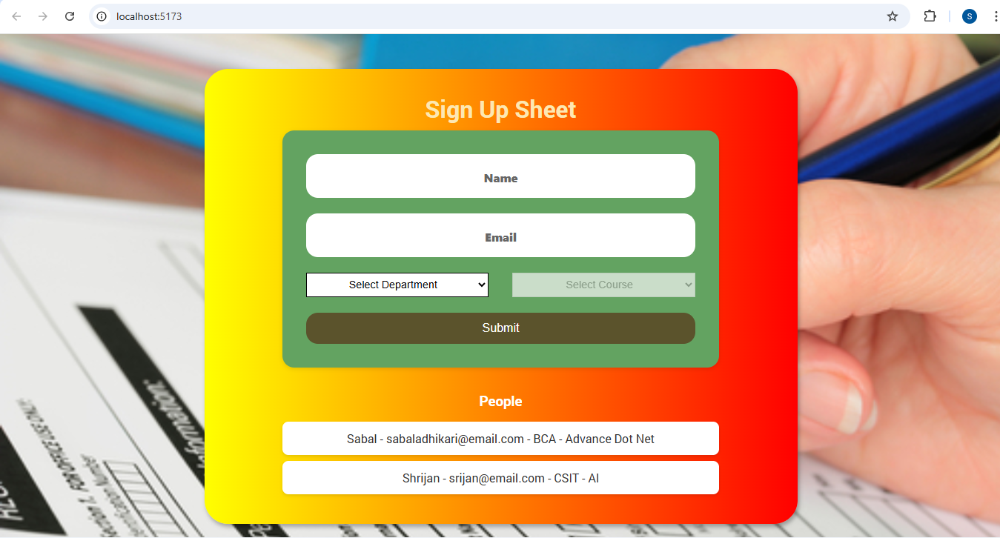

# Simple-Form-Fill-Up
This is a simple fill up form where admin is able to insert other's email and password. And the email and password is shown in the list. It's made using redux toolkit(state management library)
# Requirement
- Email
- Password
# Output
